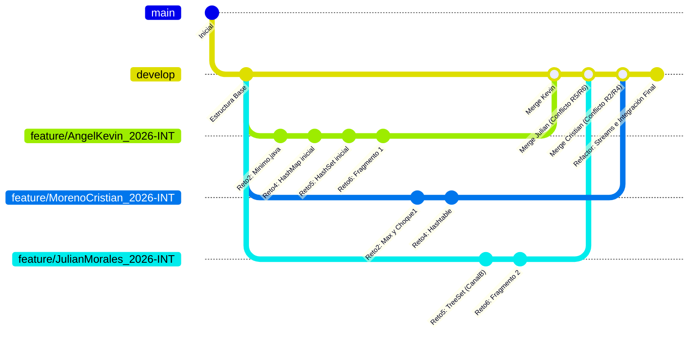

"# DOSW-Lab1-2026-INT-kevinAngel-JulianMorales-CristianMoreno" a


## Mi nombre es Kevin Andrey Angel Acevedo, considero que mis capacidades me permiten aprender temas nuevos de forma sencilla, aunque todavía estoy aprendiendo estoy lleno de ganas de  continuar adquiriendo conocimiento, en el equipo puedo aportar la proactividad y la pulir detalles, no soy perfeccionista pero me gusta hacer lo que hago de la mejor forma posible.


## Mi nombre es Cristian Santiago Moreno Ruiz y considero que soy la persona que están buscando para poder completar el equipo por diferentes razones. En primer lugar mi fortaleza es que me esfuerzo mucho por entender y cuando no tengo la respuesta busco por medio de la forma que sea encontrarla. En segundo lugar una de is fortalezas es la puntualidad en cuanto a mis obligaciones, entregas y llegadas a lugares. Por otro lado cuento con experiencia que he adquirido en otras asignaturas donde he podido conocer y reforzar diferentes lenguajes de programación y me siento muy bien en los que son Java y SQL por lo cual siento que puedo aportar mucho al equipo. Por ultimo me gustaria resaltar mi compromiso con los proyectos puesto que una vez empiezo uno lo acabo a pesar de las dificultades. 


## Mi nombre es Julian Felipe Morales Zambrano me considero que soy un candidato ideal para DOSW Company porque puedo aportar la capacidad de resolver problemas, no solo encontrando una sino que muchas soluciones a un mismo problema, también porque tengo la motivación y las ganas de aprender no solo de la compañía sino también de mis compañeros y personas que nos acompañen en nuestro camino de crecer como desarrolladores. También entre mis fortalezas se encuentra que puedo buscar la forma de apoyarme para resolver mis inquietudes, ya sea por medio de videos, conocidos, etc. También me considero una persona muy puntual que cuida mucho su tiempo, e intenta acomodar todo para que las cosas con mayor importancia se hagan de primeras, pero sin importar su lugar hago todo con el esfuerzo que merece y el tiempo.

---

# 🚀 Reporte de Desarrollo y Colaboración (Laboratorio #1)

Este documento detalla el proceso de desarrollo, integración y resolución de conflictos de los retos del **Laboratorio #1** en los que participó **Kevin Andrey Angel Acevedo (Estudiante A)**, colaborando con **Cristian Moreno** (Retos 2 y 4) y **Julian Morales** (Retos 5 y 6).

---

## 🗺️ Resumen del Flujo de Trabajo en Git

La colaboración se estructuró a través de ramas de características (`feature/`) integradas hacia la rama de desarrollo común (`develop`). A continuación, se presenta un esquema visual del proceso de integración y los puntos donde se gestionaron los conflictos:



---

## 🏎️ Reto #2: Carrera en Paralelo (Colaboración: Cristian Moreno & Kevin Angel)

### 📋 Enunciado y Roles
*   **Estudiante A (Carril 2 - Kevin Angel):** Calcular el número mínimo y la cantidad de datos ingresados mediante expresiones lambda.
*   **Estudiante B (Carril 1 - Cristian Moreno):** Calcular el número máximo de un listado mediante expresiones lambda.
*   **Choque 1:** Combinar máximo, mínimo y cantidad de datos.
*   **Choque 2:** Verificar si el mayor es múltiplo de 2 (Carril 1) y divisible entre 2 (Carril 2).
*   **Meta Final:** Fusionar todo en una función que reciba dos listas y devuelva un objeto `Resultados` con el análisis completo (máximo, mínimo, cantidad, divisibilidad y paridad de la cantidad).

### 🛠️ Desarrollo Paso a Paso
1.  **Desarrollo de Kevin (Estudiante A):**
    En su rama, Kevin creó inicialmente el archivo `Minimo.java` e implementó dos funciones lambda:
    *   `obtenerMinimo`: `lista -> lista.stream().min(Integer::compareTo).orElse(0);`
    *   `obtenerCantidad`: `List::size;`
    Además, configuró la lectura interactiva usando `Scanner` para capturar la lista desde la terminal.
2.  **Desarrollo de Cristian (Estudiante B):**
    Cristian creó la clase `Reto2.java` implementando `calculateMax` con streams e integrando las operaciones de Kevin para resolver el **Choque 1** mediante la función `combinarResults`.
3.  **Resolución de Conflictos en el Merge:**
    *   **Conflicto:** Se generó un conflicto debido a la duplicidad de archivos con distinta nomenclatura (`Minimo.java` vs `Reto2.java`) y firmas de clases internas similares.
    *   **Solución:** Se decidió unificar el código en un único archivo `Reto2.java` y se procedió a eliminar `Minimo.java` (`git rm`).
    *   **Meta Final:** Cristian completó la integración final definiendo una clase `Resultados` y encapsulando todo en la función lambda `allResults` para procesar ambas listas y formatear la salida exacta exigida.

---

## 🔑 Reto #4: El Tesoro de las Llaves Duplicadas (Colaboración: Cristian Moreno & Kevin Angel)

### 📋 Enunciado y Roles
*   **Estudiante A (Kevin Angel):** Almacenar pares clave-valor en un `HashMap` ignorando claves duplicadas (preservando el primer valor).
*   **Estudiante B (Cristian Moreno):** Almacenar pares en un `Hashtable` garantizando sincronización.
*   **Ambos (Choque):** Combinar ambos mapas. Si hay conflicto de clave, priorizar el valor del `Hashtable`. Retornar claves ordenadas alfabéticamente y en mayúsculas utilizando la API de Streams (`stream()`, `map()`, `sorted()`, `Collectors.toMap()`).

### 🛠️ Desarrollo Paso a Paso
1.  **Desarrollo de Kevin (Estudiante A):**
    Kevin implementó la lógica para capturar dinámicamente los pares clave-valor del usuario en un `HashMap` empleando `mapa.putIfAbsent(clave, valor)` para ignorar automáticamente claves ya registradas, manteniendo el primer valor ingresado.
2.  **Desarrollo de Cristian (Estudiante B):**
    Cristian estructuró el ingreso al `Hashtable` bajo la lógica de sincronización estándar.
3.  **Integración y Refactor a Streams:**
    *   **Conflicto:** Al unir los fragmentos en la rama de desarrollo, los métodos individuales usaban bucles imperativos `for`, lo cual no cumplía rigurosamente con el requerimiento de procesamiento funcional declarativo para todo el ciclo de vida del mapa.
    *   **Solución:** Kevin reescribió e integró ambas partes utilizando Streams:
        *   Para el **HashMap**:
            ```java
            IntStream.range(0, n).mapToObj(...)
                .collect(Collectors.toMap(Map.Entry::getKey, Map.Entry::getValue, (v1, v2) -> v1, HashMap::new));
            ```
        *   Para el **Hashtable**:
            ```java
            IntStream.range(0, count).mapToObj(...)
                .collect(Collectors.toMap(Map.Entry::getKey, Map.Entry::getValue, (v1, v2) -> v2, Hashtable::new));
            ```
        *   **Unificación final (Choque):** Se concatenaron ambos entrySets con `Stream.concat`, aplicando `toUpperCase()` en las claves y definiendo el merge factor `(v1, v2) -> v2` para dar prioridad absoluta a los valores de la `Hashtable` en caso de colisión de claves.
        *   Finalmente, se ordenó el mapa combinado mediante `.sorted(Map.Entry.comparingByKey())` antes de su impresión.

---

## ⚔️ Reto #5: Batalla de Conjuntos (Colaboración: Kevin Angel & Julian Morales)

### 📋 Enunciado y Roles
*   **Estudiante A (Kevin Angel):** Almacenar números desordenados en un `HashSet` y filtrar (eliminar) múltiplos de 3.
*   **Estudiante B (Julian Morales):** Almacenar números ordenados ascendentemente en un `TreeSet` y filtrar múltiplos de 5.
*   **Ambos (Choque):** Combinar ambos conjuntos en un único `TreeSet` ordenado sin duplicados usando programación funcional.

### 🛠️ Desarrollo Paso a Paso
1.  **Desarrollo de Kevin (Estudiante A):**
    Kevin creó `Reto5.java` programando `crearHashSetConScanner()` utilizando streams para convertir la entrada en texto en enteros, pasarlos a un set desordenado y aplicar el filtro `filter(n -> n % 3 != 0)`.
2.  **Desarrollo de Julian (Estudiante B):**
    Julian escribió la lógica del TreeSet en un archivo separado llamado `CanalB.java` con el filtrado de múltiplos de 5 (`filter(n -> n % 5 != 0)`).
3.  **Resolución de Conflictos en el Merge:**
    *   **Conflicto:** Se generó un conflicto en el merge manual (commit `b74310c`) debido a la discrepancia de nombres de clase (`CanalB` vs `Reto5`) e implementaciones cruzadas en el método `main`.
    *   **Solución:** Se unificaron las firmas. Kevin coordinó el merge integrando ambos métodos dentro del archivo `Reto5.java` definitivo.
4.  **Optimización e Integración (Choque):**
    *   Kevin refactorizó la lectura y el parseo del TreeSet de Julian mediante streams:
        ```java
        TreeSet<Integer> treeSet = Arrays.stream(linea.trim().split("\\s+"))
                .filter(parte -> !parte.isEmpty())
                .map(Integer::parseInt)
                .collect(Collectors.toCollection(TreeSet::new));
        ```
    *   Se creó el método `unirConjuntos` uniendo ambos sets con `Stream.concat` hacia un `TreeSet` que de forma nativa elimina duplicados y mantiene el orden ascendente:
        ```java
        public static TreeSet<Integer> unirConjuntos(Set<Integer> a, Set<Integer> b) {
            return Stream.concat(a.stream(), b.stream())
                    .collect(Collectors.toCollection(TreeSet::new));
        }
        ```
    *   La impresión final se adaptó a expresiones lambda: `unificado.stream().forEach(n -> System.out.println("Número en arena: " + n));`.

---

## 🤖 Reto #6: La Máquina de Decisiones (Colaboración: Kevin Angel & Julian Morales)

### 📋 Enunciado y Roles
*   **Estudiante A (Fragmento 1 - Kevin Angel):** Implementar switch-case para los comandos: "SALUDAR", "DESPEDIR", "CANTAR", "DANZAR".
*   **Estudiante B (Fragmento 2 - Julian Morales):** Implementar switch-case para los comandos: "BROMEAR", "GRITAR", "SUSURRAR", "ANALIZAR".
*   **Ambos (Choque):** Unificar todos los comandos en un solo `Map<String, Runnable>` utilizando expresiones lambda para guardar las acciones y ejecutarlas directamente mediante `.run()`.

### 🛠️ Desarrollo Paso a Paso
1.  **Desarrollo de Kevin (Estudiante A):**
    Kevin creó la primera versión de `Reto6.java` con el método `ejecutarComandoFragmento1(String comando)` y un switch-case estándar estructurando las 4 respuestas correspondientes a su fragmento.
2.  **Desarrollo de Julian (Estudiante B):**
    Julian programó su switch-case con las respuestas del Fragmento 2.
3.  **Resolución de Conflictos (Merge Preventivo):**
    *   **Estrategia:** Para evitar conflictos complejos al fusionar dos bloques de código extensos que modificaban los mismos archivos, Kevin y Julian acordaron realizar un borrado preventivo del archivo local de Kevin.
    *   Julian luego lideró la unificación en el commit `38ec4bd`, reuniendo ambos fragmentos en los métodos estáticos `ParteA` y `ParteB`.
4.  **Choque con Map y Runnables:**
    *   Para erradicar el uso ineficiente de condicionales múltiples en tiempo de ejecución, se mapeó cada comando a una interfaz funcional `Runnable`:
        ```java
        Map<String, Runnable> comandos = new HashMap<>();
        comandos.put("SALUDAR", () -> ParteA("SALUDAR"));
        // ...
        comandos.put("BROMEAR", () -> ParteB("BROMEAR"));
        ```
    *   La ejecución se simplificó a una sola línea:
        ```java
        comandos.getOrDefault(entrada, () -> System.out.println("Comando no reconocido: " + entrada)).run();
        ```

---

> [!NOTE]
> Todo el desarrollo del laboratorio se realizó bajo el paradigma de programación declarativa y funcional, priorizando el uso de la API de Streams y Expresiones Lambda de Java para garantizar código limpio, mantenible y eficiente.
